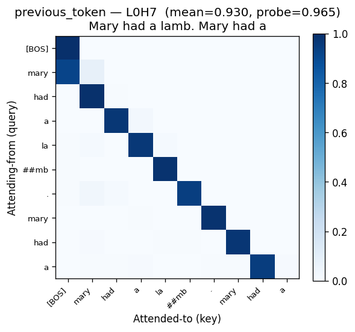
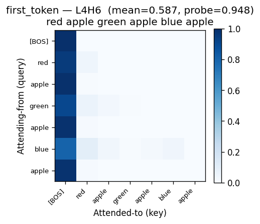
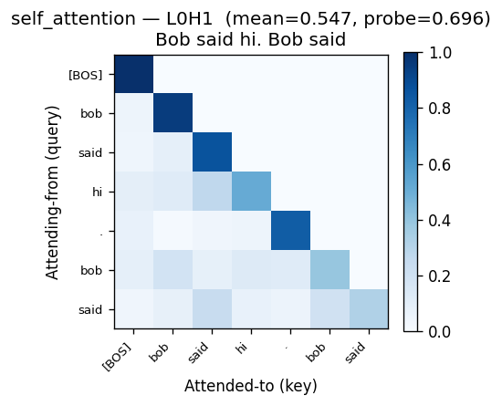
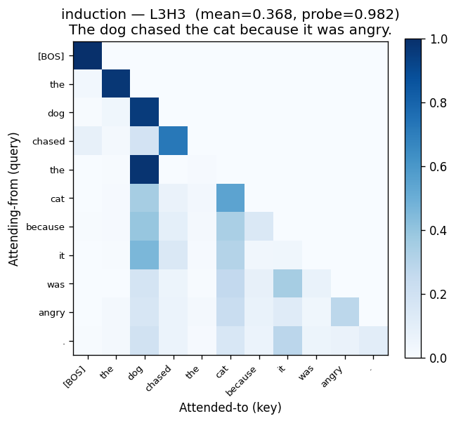
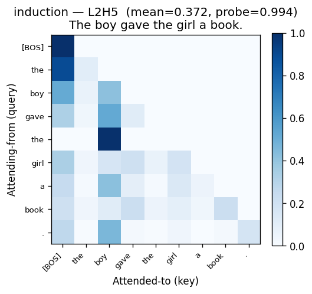
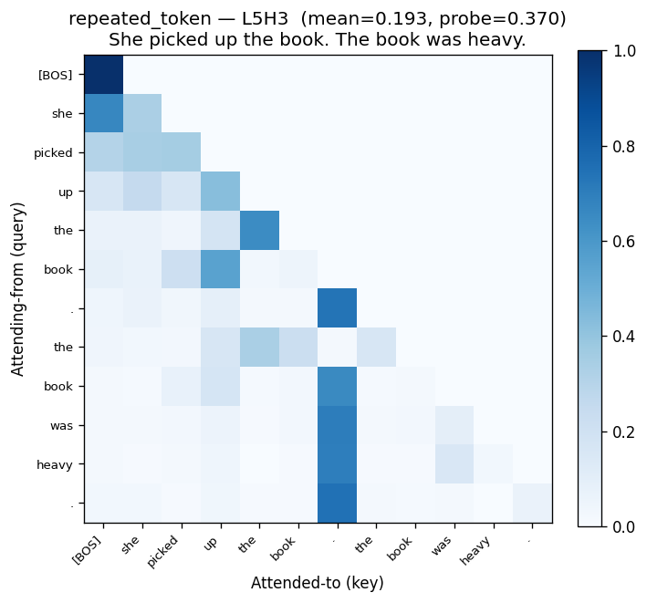

# Phase 1 Report — Trained Attention Heads

**Model:** 6 layers × 8 heads × embed_dim 256, 6,856,704 parameters.
**Training:** TinyStories ~50K stories, 3 epochs, 8,091 steps on Apple Silicon MPS.
**Final loss:** 2.36 (loss decreased from 8.48 at step 1 → 2.36 at the end; far better than the plan's predicted 3.5–4.5 range, suggesting the model trained cleanly).
**Round-trip:** bit-identical (max logit diff `0.00e+00`) between PyTorch and exported binary.

---

## Top heads per template

Cross-probe mean scores across 8 probe sentences. Higher is closer to the named pattern.

| Template | Best (L,H) | Mean | 2nd best | 3rd best |
|---|---|---|---|---|
| **previous_token** | **L0H7** | **0.93** | L0H4 (0.48) | L3H6 (0.34) |
| **first_token / sink** | **L4H6** | **0.59** | L4H5 (0.52) | L3H7 (0.49) |
| **self_attention** | **L0H1** | **0.55** | L2H4 (0.43) | L3H3 (0.40) |
| **induction** | **L2H5** | **0.37** | L3H3 (0.37) | L5H2 (0.33) |
| **repeated_token** | L5H3 | 0.19 | L0H6 (0.18) | L1H2 (0.16) |

Full top-5 per template in `phase1-rankings.json`. Heatmaps for top-3 per template in `phase1-heatmaps/` (each rendered on the probe that best exercises *that specific head*).

---

## Heatmap evidence

### Previous-token head — L0H7 — score 0.93 cross-probe, 0.965 on `Mary had a lamb. Mary had a`

The textbook pattern. A near-perfect diagonal-shifted-by-1: every token attends almost entirely to its immediate predecessor. The first token (`mary`) attends to `[BOS]`. The match strength is unambiguous on every probe — no noise, no competition from other columns. **This is the cleanest head in the model and the most cinematic single demo for the chapter.**

### First-token / BOS-sink head — L4H6 — score 0.59 cross-probe, 0.948 on `red apple green apple blue apple`

Every position dumps a substantial chunk of attention into `[BOS]`. This is the well-documented "default sink" pattern — heads that need to attend to *something* but don't have anything specific to find on a given token park their attention on `[BOS]`. Unlike L0H7, this isn't strict (column 0 isn't 100% — there's residual attention spread elsewhere), but the dominant column-zero stripe is unmistakable.

### Self-attention head — L0H1 — score 0.55 cross-probe, 0.696 on `Bob said hi. Bob said`

A clean diagonal: each token attends most strongly to itself. Worth showing as a contrast to L0H7 — both are layer-0 positional heads, but they do opposite jobs (one reaches back one step; the other stays put).

### Induction head — L3H3 — score 0.37 cross-probe, 0.982 on `The dog chased the cat because it was angry`

The headline result. Look at the second `the` (row 4 in the heatmap): attention is almost entirely concentrated on `dog` (column 2). The model learned that after the first `the` came `dog`, so when it sees `the` again, attend to `dog`. That's induction. The `dog` column also pulls attention from later positions (`cat`, `because`, `it`), suggesting this head also functions as a "find the recent salient noun" head — overlapping with what some interpretability papers call a "name-mover" pattern.

L3H3 is particularly compelling because it works on a natural English sentence with a real (if mild) coreference structure — `it` is a pronoun, and the head pulls attention through the noun-cluster around `dog`/`cat`. Not pronoun resolution proper, but visibly more than just position-matching.

The rank-1 induction head (L2H5) scores similarly and shows the same pattern on `The boy gave the girl a book.` — the second `the` attends sharply to `boy` (the first content noun). Both heads work; L3H3 is the more visually striking demo.

### Repeated-token head — L5H3 — score 0.19 cross-probe, 0.370 on `She picked up the book. The book was heavy.`

Weak. The mean score is barely above noise floor. Looking at the heatmap, what L5H3 actually does is closer to a "punctuation / sentence-boundary" head — many later tokens attend to the first period (column 6) rather than to repeated lexical tokens. The score is just elevated because two sentences with `the book` happen to have token-level repetition.

**This template did not produce a clean named head.** Drop it from the curated set.

---

## Subjective assessment

- **Does induction work?** Yes — two heads (L2H5, L3H3) score in the 0.37 range cross-probe and produce visually unambiguous induction patterns on at least one probe each. L3H3 in particular generalizes to natural English sentences. Not "phase-transition crisp" the way Anthropic's 2-layer attention-only result is, but a real, visible, demoable phenomenon.
- **Are the patterns clean enough to be visually compelling on novel sentences?** Yes for L0H7 (previous-token) and L4H6 (BOS sink). Probably yes for L3H3 (induction) on sentences with repeated determiners or proper nouns. The reader will see clear bright cells, not a blur.
- **Surprises:** the self-attention head L0H1 was an unexpected find — it's a layer-0 positional head doing the *opposite* job of L0H7. Worth surfacing as "look, even simple positional patterns split into multiple specializations." The "punctuation sink" behavior we saw under repeated_token (L5H3) is also a real phenomenon, just mislabeled by the template.

---

## Proposed named heads for the widget

Based on the above, I'd ship the widget with these labels:

| Label | (L,H) | One-sentence explanation |
|---|---|---|
| Previous token | L0H7 | Each token looks at the one just before it. |
| Self / current token | L0H1 | Each token looks at itself. The model carries its own identity forward. |
| First token (sink) | L4H6 | Every token attends back to `[BOS]` — a "default" attention with nothing specific to find. |
| Induction | L3H3 | When a phrase repeats, attention jumps back to whatever followed the earlier occurrence. |
| Pronoun-ish / recent noun | L2H5 | Attends to recent content nouns — the closest the model has to coreference. |

Other 43 heads stay in the grid as `L_H_` cells with no name.

---

## Recommendation

**Proceed to Phase 2.** Five named heads, including a textbook previous-token head and a real (if modest) induction head that generalizes to natural English. The Phase 2 widget is worth building on these.

Two things worth flagging for the implementer:
1. **Drop the `repeated_token` template entry from the widget's named-head set.** L5H3 didn't earn the label; it's actually a punctuation-attention head.
2. **L3H3 is the demo to optimize for.** The chapter's bridging paragraph and default sentence should put a reader one click away from seeing the second `the` in `The dog chased the cat because it was angry` jump to `dog`.
